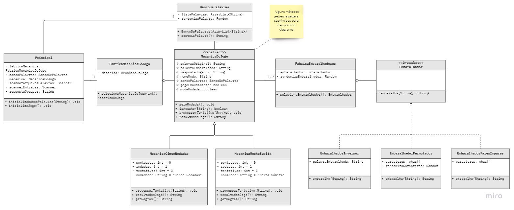

# Jogo das Palavras Embaralhadas

Projeto desenvolvido como trabalho final do curso de [Orientação a Objetos com Java](https://pt.coursera.org/learn/orientacao-a-objetos-com-java?) ministrado pelo ITA (Instituto Tecnológico da Aeronática) e ofertado pela plataforma Coursera.

## Visão Geral

A atividade teve como objetivo a utilização das estratégias abordadas no curso para desenvolver classes e interfaces em Java. Pretende-se produzir um jogo que possa ter funcionalidades expandidas de maneira escalável sem comprometer o funcionamento global do projeto.

O usuário interage com o jogo por meio do terminal. São impressos no console palavras com as letras embaralhadas e o jogador deve adivinhar qual a palavra original.

O programa seleciona aleatoriamente as palavras através de uma lista contida em um arquivo txt.
## Modos de Jogo

Através do terminal o usuário pode selecionar entre dois modos de jogo:

### Cinco Rodadas: 

- O jogo tem 5 rodadas, com 3 tentativas cada; 
- Palavras embaralhadas de maneiras diferentes;
- A pontuação de cada rodada é igual ao número de tentivas restantes na hora do acerto.

### Morte Súbita: 

- O jogo tem rodadas infinitas, mas acaba no primeiro erro; 
- Palavras embaralhadas de maneiras diferentes;
- A pontuação de cada rodada é igual ao número da rodada.

## Embaralhadores

Em ambos os modos de jogo, as palavras são embaralhadas utilizando três algoritmos diferentes que são selecionados aleatoriamente no início de cada rodada. As três opções implementadas são:

### Embaralhador Inversor:

As palavras tem a ordem de suas letras invertidas. Ex:

``palavra -> arvalap``

### Embaralhador Permutador:

Implementa o [Embaralhamento de Fisher Yattes](https://en.wikipedia.org/wiki/Fisher–Yates_shuffle). Ex:

``palavra -> alrvaap``

### Embaralhador Pares e Ímpares:

Determina o índice de cada letra e inverte as ímpares com a letra par imediatamente à sua esquerda. Ex:

``palavra -> apalrva``

## Estrutura do projeto

As classes elaboradas interagem entre si conforme o diagrama UML abaixo:

## Demonstração 

O funcionamento do projeto pode ser verificado ao clicar na thumbnail abaixo: 

